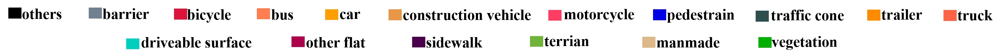
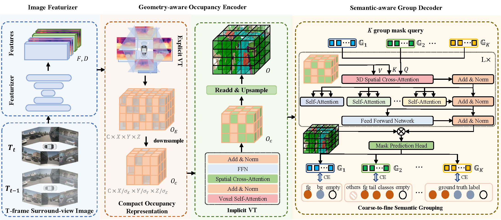

<div align="center">
<h2>COTR: Compact Occupancy TRansformer for Vision-based Occupancy Prediction</h2>

[**Qihang Ma**](https://scholar.google.com/citations?user=MAfVfFsAAAAJ)<sup>1*</sup> · [**Xin Tan**](https://tanxincs.github.io/)<sup>1,2*</sup> · [**Yanyun Qu**](https://quyanyun.xmu.edu.cn/index.htm)<sup>3</sup> · [**Lizhuang Ma**](https://dmcv.sjtu.edu.cn/people/)<sup>1</sup> · [**Zhizhong Zhang**](https://scholar.google.com/citations?user=CXZciFAAAAAJ)<sup>1+</sup> · [**Yuan Xie**](https://scholar.google.com/citations?user=RN1QMPgAAAAJ)<sup>1,2</sup>

<sup>1</sup>Eash China Normal University · <sup>2</sup>Chongqing Institute of ECNU · <sup>3</sup>Xiamen University

<sup>*</sup>equal contribution, <sup>+</sup>corresponding authors

**CVPR 2024**

<a href="https://arxiv.org/abs/2312.01919"></a>
</div>




## 🚀 News
- **2024.04.01** Code released.
- **2024.02.27** :star2: COTR is accepted by CVPR 2024.
- **2023.12.04** [**arXiv**](https://arxiv.org/abs/2312.01919) preprint released. 

## 📝 Introduction
The autonomous driving community has shown significant interest in 3D occupancy prediction, driven by its exceptional geometric perception and general object recognition capabilities. To achieve this, current works try to construct a Tri-Perspective View (TPV) or Occupancy (OCC) representation extending from the Bird-Eye-View perception. However, compressed views like TPV representation lose 3D geometry information while raw and sparse OCC representation requires heavy but redundant computational costs. To address the above limitations, we propose Compact Occupancy TRansformer (COTR), with a geometry-aware occupancy encoder and a semantic-aware group decoder to reconstruct a compact 3D OCC representation. The occupancy encoder first generates a compact geometrical OCC feature through efficient explicit-implicit view transformation. Then, the occupancy decoder further enhances the semantic discriminability of the compact OCC representation by a coarse-to-fine semantic grouping strategy. Empirical experiments show that there are evident performance gains across multiple baselines, e.g., COTR outperforms baselines with a relative improvement of 8%-15%, demonstrating the superiority of our method.

## 💡 Method


The overall architecture of COTR. T-frame surround-view images are first fed into the image featurizers to get the image features and depth distributions. Taking the image features and depth estimation as input, the geometry-aware occupancy encoder constructs a compact occupancy representation through efficient explicit-implicit view transformation. The semantic-aware group decoder utilizes a coarse-to-fine semantic grouping strategy cooperating with the Transformer-based mask classification to strongly strengthen the semantic discriminability of the compact occupancy representation.


## 🔧 Get Started

#### Installation and Data Preparation

step 1. Please prepare environment as that in [Install](docs/en/install.md).

step 2. Prepare nuScenes dataset as introduced in [nuscenes_det.md](docs/en/datasets/nuscenes_det.md) and create the pkl for BEVDet by running:
```shell
python tools/create_data_bevdet.py
```
step 3. For Occupancy Prediction task, download (only) the 'gts' from [CVPR2023-3D-Occupancy-Prediction](https://github.com/CVPR2023-3D-Occupancy-Prediction/CVPR2023-3D-Occupancy-Prediction) and arrange the folder as:
```shell script
└── nuscenes
    ├── v1.0-trainval (existing)
    ├── sweeps  (existing)
    ├── samples (existing)
    └── gts (new)
```

#### Train model
```shell
# single gpu
python tools/train_occ.py $config
# multiple gpu
./tools/dist_train_occ.sh $config num_gpu
```

#### Test model
```shell
# single gpu
python tools/test_occ.py $config $checkpoint --eval mIoU
# multiple gpu
./tools/dist_test_occ.sh $config $checkpoint num_gpu --eval mIoU
```

#### Train & Test model
```shell
# multiple gpu
./train_eval_occ.sh $config num_gpu
```

#### Visualize the predicted result.

```shell
python tools/dist_test.sh $config $checkpoint --out $savepath
python tools/analysis_tools/vis_frame.py $savepath $config --save-path $scenedir --scene-idx $sceneidx --vis-gt
python tools/analysis_tools/generate_gifs.py --scene-dir $scenedir
```

## 🙏 Acknowledgement

This project is not possible without multiple great open-sourced code bases. We list some notable examples below.

- [open-mmlab](https://github.com/open-mmlab)
- [Occ3D](https://github.com/Tsinghua-MARS-Lab/Occ3D)
- [BEVDet](https://github.com/HuangJunJie2017/BEVDet)
- [BEVFormer](https://github.com/fundamentalvision/BEVFormer)
- [TPVFormer](https://github.com/wzzheng/TPVFormer)
- [SurroundOcc](https://github.com/weiyithu/SurroundOcc)
- [OccFormer](https://github.com/zhangyp15/OccFormer)
- [FB-OCC](https://github.com/NVlabs/FB-BEV)


## 📃 Bibtex

If this work is helpful for your research, please consider citing the following BibTeX entry.

```
@article{ma2023cotr,
  title={COTR: Compact Occupancy TRansformer for Vision-based 3D Occupancy Prediction},
  author={Ma, Qihang and Tan, Xin and Qu, Yanyun and Ma, Lizhuang and Zhang, Zhizhong and Xie, Yuan},
  journal={arXiv preprint arXiv:2312.01919},
  year={2023}
}
```
